# Distributed Systems — Concept Graph

> Based on Week 1 materials: **Distributed systems — models, time, consistency and trade-offs** and **Professional engineering foundations for distributed systems**.

```mermaid
flowchart TD

    A["DISTRIBUTED SYSTEMS"] --> B["Core Foundations"]
    A --> C["Professional Engineering"]

    %% -------------------------
    %% PDF 1 - CORE FOUNDATIONS
    %% -------------------------

    B --> B1["What changes across a network?"]
    B1 --> B1a["No shared memory/state"]
    B1 --> B1b["No single global clock"]
    B1 --> B1c["Failures are not all-or-nothing"]
    B1 --> B1d["Messages travel over an unreliable network"]

    B1d --> B2["Fallacies of Distributed Computing"]
    B2 --> B2a["The network is reliable"]
    B2 --> B2b["Latency is zero"]
    B2 --> B2c["Bandwidth is infinite"]
    B2 --> B2d["The network is secure"]
    B2 --> B2e["Topology does not change"]
    B2 --> B2f["There is one administrator"]
    B2 --> B2g["Transport cost is zero"]
    B2 --> B2h["The network is homogeneous"]

    B --> B3["System and Failure Models"]
    B3 --> B3a["Timing Models"]
    B3a --> B3a1["Synchronous"]
    B3a --> B3a2["Asynchronous"]

    B3 --> B3b["Failure Models"]
    B3b --> B3b1["Crash-stop"]
    B3b --> B3b2["Crash-recovery"]
    B3b --> B3b3["Omission"]
    B3b --> B3b4["Byzantine"]

    B3b1 --> B3c["Increasing failure complexity"]
    B3b2 --> B3c
    B3b3 --> B3c
    B3b4 --> B3c

    B --> B4["Logical Time and Causality"]
    B4 --> B4a["Wall-clock time is unreliable across nodes"]
    B4 --> B4b["Lamport Happens-Before"]
    B4b --> B4b1["A → B means A causally precedes B"]
    B4b --> B4b2["No causal path = concurrent events"]
    B4 --> B4c["Lamport Clocks"]
    B4c --> B4c1["Total order consistent with causality"]
    B4c --> B4c2["Does not prove A → B from L(A) < L(B)"]
    B4 --> B4d["Vector Clocks"]
    B4d --> B4d1["Needed for richer causal reasoning"]

    B --> B5["Consistency Spectrum"]
    B5 --> B5a["Strong / Linearizable"]
    B5 --> B5b["Sequential"]
    B5 --> B5c["Causal"]
    B5 --> B5d["Eventual"]
    B5a --> B5e["More coordination"]
    B5e --> B5f["Higher latency"]
    B5d --> B5g["More availability"]
    B5g --> B5h["More scalability"]

    B --> B6["CAP and PACELC"]
    B6 --> B6a["CAP"]
    B6a --> B6a1["Under Partition: choose Consistency or Availability"]
    B6 --> B6b["PACELC"]
    B6b --> B6b1["If Partition: Consistency vs Availability"]
    B6b --> B6b2["Else: Latency vs Consistency"]

    B5a --> B6c["Use for money movement / inventory decrement"]
    B5c --> B6d["Use for user profile / catalog"]
    B5d --> B6e["Use for metrics / feeds / counters"]

    B --> B7["Replication, Partitioning and Quorums"]
    B7 --> B7a["Replication"]
    B7a --> B7a1["Copies improve availability and reads"]
    B7 --> B7b["Partitioning / Sharding"]
    B7b --> B7b1["Split data to scale"]
    B7 --> B7c["Quorum"]
    B7c --> B7c1["N = number of replicas"]
    B7c --> B7c2["W = write quorum"]
    B7c --> B7c3["R = read quorum"]
    B7c --> B7c4["R + W > N → read overlaps latest write"]

    B --> B8["Consensus"]
    B8 --> B8a["Nodes agree on one value/order despite failures"]
    B8 --> B8b["FLP Impossibility"]
    B8b --> B8b1["Purely asynchronous consensus cannot be guaranteed in bounded time with one crash"]
    B8 --> B8c["Practical progress"]
    B8c --> B8c1["Timeouts"]
    B8c --> B8c2["Randomization"]
    B8 --> B8d["Raft"]
    B8d --> B8d1["Leader"]
    B8d --> B8d2["Replicated log"]
    B8d --> B8d3["Followers"]
    B8d --> B8d4["Entry commits after majority acknowledgement"]

    B --> B9["Communication and Delivery Semantics"]
    B9 --> B9a["Synchronous"]
    B9a --> B9a1["REST / gRPC"]
    B9a --> B9a2["Caller is time-coupled to callee"]
    B9 --> B9b["Asynchronous"]
    B9b --> B9b1["Kafka / RabbitMQ"]
    B9b --> B9b2["Decouples services in time"]
    B9 --> B9c["At-most-once"]
    B9c --> B9c1["May lose messages"]
    B9 --> B9d["At-least-once"]
    B9d --> B9d1["May duplicate messages"]
    B9d --> B9d2["Consumers must be idempotent"]
    B9 --> B9e["Exactly-once"]
    B9e --> B9e1["Not a literal network delivery guarantee"]
    B9e --> B9e2["Practical goal: exactly-once processing"]
    B9e2 --> B9e3["At-least-once delivery + idempotency key + deduplication/outbox"]

    B --> B10["Real-life Failure Path: Place Order"]
    B10 --> B10a["Reserve inventory"]
    B10 --> B10b["Charge payment"]
    B10 --> B10c["Confirm order"]
    B10 --> B10d["Network partition may happen mid-request"]
    B10d --> B10e["Do not block holding a DB lock"]
    B10d --> B10f["Use Saga"]
    B10f --> B10f1["Reserve stock → charge → confirm"]
    B10f --> B10f2["If charge fails → compensate by releasing stock"]
    B10d --> B10g["Payment call should be at-least-once"]
    B10g --> B10g1["Use idempotency key"]
    B10d --> B10h["Tell the user the real state"]
    B10h --> B10h1["Example: order received, payment confirmation pending"]

    %% -----------------------------------
    %% PDF 2 - PROFESSIONAL ENGINEERING
    %% -----------------------------------

    C --> C1["Executable Standards"]
    C1 --> C1a["Quality must be mechanical, not aspirational"]
    C1 --> C1b["Rules must fail the build when violated"]
    C1 --> C1c["MVP reduces scope, never standards"]

    C --> C2["Domain-Driven Design"]
    C2 --> C2a["Strategic DDD"]
    C2a --> C2a1["Bounded Contexts"]
    C2a1 --> C2a2["Natural microservice boundaries"]
    C2a --> C2a3["Ubiquitous Language"]
    C2a --> C2a4["Context Mapping"]

    C2 --> C2b["Tactical DDD"]
    C2b --> C2b1["Entities"]
    C2b --> C2b2["Value Objects"]
    C2b --> C2b3["Aggregates"]
    C2b3 --> C2b4["Only consistency / mutation boundary"]
    C2b --> C2b5["Domain Events"]

    C --> C3["Hexagonal Architecture"]
    C3 --> C3a["Core = Domain + Application / Use Cases"]
    C3 --> C3b["Ports = Interfaces"]
    C3 --> C3c["Adapters = Implementations"]
    C3 --> C3d["External inputs"]
    C3d --> C3d1["HTTP"]
    C3d --> C3d2["CLI"]
    C3d --> C3d3["Queue"]
    C3 --> C3e["External outputs"]
    C3e --> C3e1["Database"]
    C3e --> C3e2["Cache"]
    C3e --> C3e3["External API"]
    C3 --> C3f["Dependency rule"]
    C3f --> C3f1["Adapters → Application → Domain"]
    C3f --> C3f2["Never inward-out"]
    C3 --> C3g["Violation example"]
    C3g --> C3g1["Domain imports ORM/DB driver directly"]

    C --> C4["SOLID and Clean Code"]
    C4 --> C4a["SRP"]
    C4a --> C4a1["One reason to change per module"]
    C4 --> C4b["DIP"]
    C4b --> C4b1["Depend on ports, inject adapters"]
    C4 --> C4c["OCP / ISP"]
    C4c --> C4c1["Small, specific interfaces"]
    C4 --> C4d["Clean Code"]
    C4d --> C4d1["Honest names"]
    C4d --> C4d2["Small functions"]
    C4d --> C4d3["No dead TODO/FIXME in CI"]
    C4d --> C4d4["Explicit error handling"]

    C --> C5["Resilience Patterns"]
    C5 --> C5a["Circuit Breaker"]
    C5a --> C5a1["Stop hammering failing dependency"]
    C5a --> C5a2["Fail fast and recover gracefully"]

    C5 --> C5b["Retry + Backoff + Jitter"]
    C5b --> C5b1["Handle transient failures"]
    C5b --> C5b2["Avoid retry storms"]

    C5 --> C5c["Timeout / Bulkhead"]
    C5c --> C5c1["Bound waiting time"]
    C5c --> C5c2["Isolate pools and dependencies"]

    C5 --> C5d["Saga"]
    C5d --> C5d1["Cross-service consistency without distributed transactions"]
    C5d --> C5d2["Uses compensating actions"]

    C5 --> C5e["Outbox"]
    C5e --> C5e1["Commit DB state and publish event atomically"]
    C5e --> C5e2["Avoid lost events"]

    C5 --> C5f["CQRS"]
    C5f --> C5f1["Separate write model from read model"]

    C --> C6["Testing Strategy"]
    C6 --> C6a["Test at the cheapest level that gives confidence"]
    C6 --> C6b["Unit Tests"]
    C6 --> C6c["Integration Tests"]
    C6 --> C6d["Contract Tests"]
    C6d --> C6d1["Protect producer/consumer compatibility"]
    C6 --> C6e["End-to-End Tests"]
    C6 --> C6f["Testcontainers"]
    C6f --> C6f1["Real DB in integration tests"]
    C6 --> C6g["Coverage Floor"]
    C6g --> C6g1["Declared coverage may never exceed measured coverage"]
    C6 --> C6h["One behavior per test"]
    C6 --> C6i["Red before green"]

    C --> C7["Ways of Working"]
    C7 --> C7a["Scrum"]
    C7a --> C7a1["Weekly Sprints"]
    C7a --> C7a2["Prioritized Backlog"]
    C7a --> C7a3["User Stories"]
    C7a3 --> C7a4["As a role, I want an action, so that benefit"]
    C7a3 --> C7a5["Testable acceptance criteria"]

    C7 --> C7b["Definition of Ready"]
    C7b --> C7b1["Before starting"]
    C7 --> C7c["Definition of Done"]
    C7c --> C7c1["Implemented"]
    C7c --> C7c2["Tested"]
    C7c --> C7c3["Criteria met"]
    C7c --> C7c4["Security addressed"]
    C7c --> C7c5["Documentation updated"]
    C7c --> C7c6["Validated at runtime"]

    C7 --> C7d["Git Flow"]
    C7d --> C7d1["develop"]
    C7d --> C7d2["qa"]
    C7d --> C7d3["main / production"]
    C7d --> C7d4["One HU branch per environment"]
    C7d4 --> C7d5["PR back to the same environment"]
    C7d5 --> C7d6["Repeat for next environment"]

    C7 --> C7e["ADRs"]
    C7e --> C7e1["Architecture Decision Records"]
    C7e --> C7e2["Document chosen architecture decisions"]

    C --> C8["Repository Ecosystem"]
    C8 --> C8a["docs repository"]
    C8 --> C8b["backend repository"]
    C8 --> C8c["database repository"]
    C8 --> C8d["frontend repository"]
    C8 --> C8e["Services remain independent"]

    C --> C9["Weekly Individual Deliverable"]
    C9 --> C9a["Each student proves individual contribution"]
    C9 --> C9b["Work is delivered in the student's fork"]
    C9 --> C9c["Exact README structure"]
    C9c --> C9c1["CONFIG"]
    C9c --> C9c2["Worked user story"]
    C9c --> C9c3["Evidence links"]
    C9c --> C9c4["Compliance checklist"]
    C9 --> C9d["Automatically graded"]
    C9 --> C9e["Profile repo CONFIG must match identity"]

    %% -------------------------
    %% CROSS-PDF CONNECTIONS
    %% -------------------------

    B3 --> X1["Failure awareness drives resilient design"]
    X1 --> C5

    B5 --> X2["Consistency requirements influence service design"]
    X2 --> C2b3
    X2 --> C5d

    B6 --> X3["CAP/PACELC decisions affect architecture trade-offs"]
    X3 --> C3
    X3 --> C5

    B7 --> X4["Replication and quorum choices affect availability and latency"]
    X4 --> C5c

    B8 --> X5["Consensus supports coordinated distributed state"]
    X5 --> C5

    B9d2 --> X6["Idempotency becomes an implementation requirement"]
    X6 --> C4
    X6 --> C5e

    B9b --> X7["Asynchronous messaging needs event-driven patterns"]
    X7 --> C5d
    X7 --> C5e

    B10f --> X8["Real failure handling becomes a Saga pattern"]
    X8 --> C5d

    B10g1 --> X9["Delivery semantics connect theory to application correctness"]
    X9 --> C4d4
    X9 --> C6

    C2a1 --> X10["Bounded contexts define microservice boundaries"]
    X10 --> A

    C3 --> X11["Hexagonal architecture isolates infrastructure from business logic"]
    X11 --> C6

    C6 --> X12["Testing validates distributed-system behavior"]
    X12 --> B3
    X12 --> B9

    C7 --> X13["Engineering workflow turns theory into a production system"]
    X13 --> A
```

## General Idea

The two documents complement each other.

- **The first document explains the theoretical foundations of distributed systems.** It focuses on what changes when a system crosses a network boundary: independent failures, unreliable communication, lack of shared state, absence of a trustworthy global clock, consistency trade-offs, replication, quorums, consensus, and delivery semantics.
- **The second document explains how to engineer those systems professionally.** It applies Domain-Driven Design, hexagonal architecture, SOLID principles, Clean Code, resilience patterns, testing strategies, Scrum, Git workflows, ADRs, and evidence-based delivery practices.
- The central relationship is that **distributed-systems theory defines the problems and trade-offs, while professional engineering defines the structures, patterns, tests, and workflows used to handle them in real software.**

## Key Connections Between Both Documents

1. **Failure Models → Resilience Patterns**  
   Crash-recovery, omission, latency, and network partitions motivate patterns such as Circuit Breaker, Retry with Backoff and Jitter, Timeout, Bulkhead, Saga, and Outbox.

2. **Consistency → Aggregates and Saga**  
   Strong consistency is appropriate for operations such as payments and inventory. Inside a bounded context, the aggregate is the consistency boundary. Across services, Saga provides consistency through compensating actions.

3. **CAP / PACELC → Architecture Trade-offs**  
   Distributed systems must choose between consistency, availability, and latency depending on the situation. These choices affect service boundaries, database behavior, communication style, and resilience mechanisms.

4. **At-Least-Once Delivery → Idempotency**  
   At-least-once messaging can create duplicates. Therefore, consumers must be idempotent and often use idempotency keys and deduplication.

5. **Asynchronous Communication → Saga and Outbox**  
   Messaging systems decouple services in time. Saga coordinates multi-service business processes, while Outbox helps avoid inconsistencies between database commits and published events.

6. **Bounded Contexts → Microservices**  
   In strategic DDD, bounded contexts define natural microservice boundaries. Each context owns its language, model, and consistency rules.

7. **Hexagonal Architecture → Isolation**  
   Ports and adapters prevent infrastructure concerns such as databases, APIs, queues, and frameworks from contaminating domain logic.

8. **Testing → Distributed Correctness**  
   Unit, integration, contract, and end-to-end tests validate behavior at different levels. Testcontainers provide realistic infrastructure for integration tests.

9. **Theory → Production Engineering**  
   Concepts such as partitions, consistency, failure paths, idempotency, and consensus become concrete engineering decisions through resilience patterns, architecture rules, tests, and delivery workflows.

## Final Concept

> **A distributed system is not only a group of services communicating over a network. It is a system designed to remain correct and useful despite unreliable communication, independent failures, concurrency, replication, and partial availability. Professional engineering practices transform these theoretical constraints into maintainable, testable, resilient, and production-ready software.**
