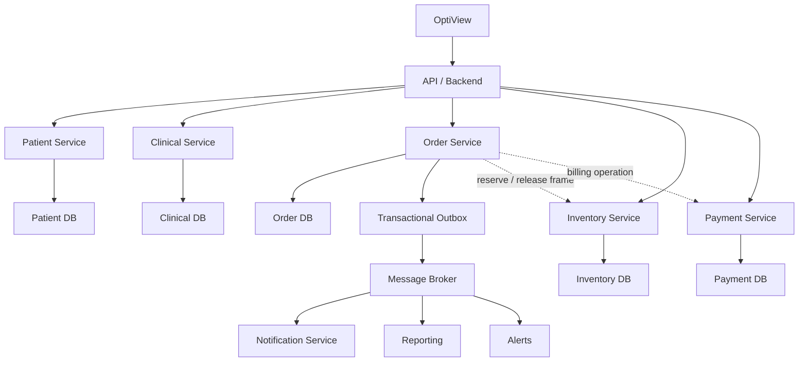

# OptiView — Initial PDR Technical Proposal

## 1. Purpose

This document presents an initial individual technical contribution to the OptiView PDR. OptiView is a web-based management system for optical stores that centralizes patients, optical prescriptions, work orders, inventory, payments, laboratories, reports, and patient notifications.

The purpose of this proposal is to connect OptiView's functional requirements with distributed systems concepts studied during Week 01.

## 2. Proposed Domain Boundaries

I propose the following bounded contexts:

- **Patient Management:** patient information, contact data, insurance/EPS information, visual history, and follow-up dates.
- **Clinical Management:** optical prescriptions, OD/OI measurements, optometrist information, and prescription history.
- **Order Management:** work orders, selected prescriptions, frames, lenses, treatments, laboratories, order status, and estimated delivery dates.
- **Inventory Management:** frames, references, brands, stock, minimum stock, suppliers, and inventory reservations.
- **Billing and Payments:** order totals, partial payments, outstanding balances, and payment history.
- **Notification Management:** order status notifications, delivery notifications, follow-up reminders, and pending balance notifications.

## 3. Inventory Consistency

When a seller creates a work order, OptiView must verify that the selected frame is still available before confirming the order.

I propose using **strong consistency** for inventory reservation and decrement operations. This prevents two sellers from simultaneously selling the last available unit of the same frame.

```text
Patient → Prescription → Frame Selection → Inventory Validation
        → Inventory Reservation → Order Confirmation
```

The work order should only be confirmed after inventory has been successfully reserved.

## 4. Saga for Work Order Processing

Creating a work order can involve operations across different services. I propose using the **Saga pattern** instead of a distributed transaction.

```text
Create Order → Reserve Frame ✓ → Create Billing Record ✗
                                      ↓
                               Compensation
                                      ↓
                              Release Reserved Frame
```

If a later operation fails, a compensating action restores the previous business state.

## 5. Payment Idempotency

OptiView supports partial payments, so payment registration must prevent duplicate operations.

I propose assigning an **idempotency key** to each payment request. If a network failure causes a retry, the Payment Service checks whether that key was already processed and returns the existing result instead of registering the payment twice.

This prevents duplicate payments and incorrect outstanding balances.

## 6. Asynchronous Patient Notifications

Order status changes should not depend on the immediate availability of the notification component.

```text
Order Service → OrderStatusChanged Event → Message Broker
                                           ↓
                                  Notification Service
                                           ↓
                                        Patient
```

For example, when an order changes from `In Laboratory` to `Ready`, the Order Service publishes an event. A temporary notification failure should not prevent the order status from being updated.

## 7. Transactional Outbox

A database update could succeed while publication of its corresponding event fails. I propose using the **Transactional Outbox** pattern.

```text
Database Transaction
├── Update Order Status
└── Save Domain Event
          ↓
        Outbox
          ↓
    Message Broker
          ↓
Notification Service
```

The state change and event are stored in the same local transaction, reducing the risk of losing important domain events.

## 8. Resilience

For external dependencies such as notification providers, laboratory integrations, or payment services, I propose:

- Retry for transient failures.
- Exponential backoff and jitter to avoid retry storms.
- Timeouts to bound waiting time.
- Circuit Breaker when a dependency repeatedly fails.

These mechanisms help prevent cascading failures.

## 9. Communication Strategy

**Synchronous communication** should be used when an immediate response is required, such as searching for a patient, retrieving a prescription, checking inventory, viewing an order, or checking an outstanding balance. REST or gRPC can support these interactions.

**Asynchronous communication** should be used for operations that do not need to block the user's request, such as patient notifications, follow-up reminders, low-stock alerts, order status events, and reporting events. Kafka or RabbitMQ could support these interactions.

## 10. Hexagonal Architecture

Each service should isolate business logic from infrastructure using ports and adapters.

```text
REST Controller
      ↓
  Input Port
      ↓
   Use Case
      ↓
    Domain
      ↓
  Output Port
   ↙       ↘
Database   Message Broker
Adapter       Adapter
```

The domain layer should not directly depend on database drivers, HTTP frameworks, message brokers, or external APIs.

## 11. Testing Strategy

- **Unit tests:** validate domain rules such as inventory availability, prescriptions, order state transitions, and payment rules.
- **Integration tests:** validate repositories, databases, message brokers, and Outbox processing.
- **Contract tests:** validate compatibility between services such as Order Management and Inventory Management.
- **End-to-end tests:** validate the complete flow from patient registration through prescription, work order, inventory reservation, payment, laboratory processing, and patient notification.

## 12. Initial Distributed Architecture



## 13. Main Proposal

> **Design the failure paths before assuming the success path.**

OptiView should assume that network calls can fail, messages can be duplicated, services can become temporarily unavailable, and multiple users can modify business data concurrently.

The initial architecture therefore proposes strong consistency for critical inventory operations, Saga for multi-service processes, idempotency for retryable payments, asynchronous events for notifications, Transactional Outbox for reliable event publication, resilience patterns for external dependencies, hexagonal architecture, and automated testing.

This is an **initial Week 01 proposal** and can be refined as the team defines the final bounded contexts, responsibilities, user stories, and technical architecture.
